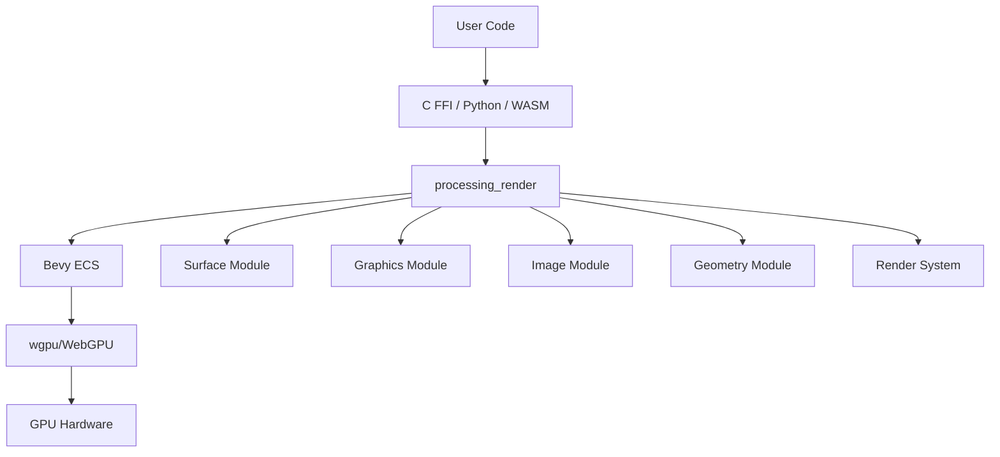

# libprocessing Codebase Knowledge Document

**Generated:** 2026-01-25  
**Purpose:** Complete technical reference for implementing features, fixing bugs, and refactoring safely

---

## Table of Contents

1. [High-Level Overview](#high-level-overview)
2. [System Architecture](#system-architecture)
3. [Feature-by-Feature Analysis](#feature-by-feature-analysis)
4. [Nuances, Subtleties & Gotchas](#nuances-subtleties--gotchas)
5. [Technical Reference & Glossary](#technical-reference--glossary)
6. [State Block](#state-block)

---

## High-Level Overview

### What is libprocessing?

**libprocessing** is an experimental native library that implements the core Processing API in Rust, built on top of the Bevy game engine. It uses WebGPU as its rendering backend and is designed to support desktop, mobile, and web targets.

**Business Purpose:** The library serves as a modern, cross-platform replacement for Processing's legacy OpenGL renderer (JOGL), which faces deprecation issues on modern platforms (especially macOS). It enables Processing to continue operating on modern graphics APIs while providing a foundation for future Processing implementations in Java and other languages.

### Main Features

1. **Surface Management** - Create and manage rendering surfaces (windows, offscreen buffers)
2. **Graphics Context** - Immediate-mode drawing API with state management
3. **Image Handling** - Load, create, manipulate, and read back images
4. **Geometry System** - Retained-mode geometry for complex shapes and 3D models
5. **Transform System** - Matrix stack for coordinate transformations
6. **Command Recording** - Deferred command execution for immediate-mode API
7. **Multi-Platform Support** - macOS, Windows, Linux (X11/Wayland), WebAssembly

### Tech Stack

- **Language:** Rust (Edition 2024)
- **Game Engine:** Bevy (main branch from git)
- **Rendering:** WebGPU via wgpu (Rust implementation)
- **Build System:** Cargo (Rust package manager)
- **Command Runner:** just
- **FFI Generation:** cbindgen (for C headers)
- **Python Bindings:** PyO3
- **WASM Bindings:** wasm-bindgen

### Architecture Type

**Hybrid Immediate/Retained Mode Architecture:**
- **User-facing API:** Immediate-mode (imperative, function-driven, like Processing sketches)
- **Internal Implementation:** Retained-mode ECS (Entity Component System) using Bevy
- **Key Challenge:** Bridging the gap between immediate-mode expectations and retained-mode efficiency

### Directory Structure

```
libprocessing/
├── crates/
│   ├── processing_render/    # Core rendering library
│   ├── processing_ffi/       # C FFI bindings
│   ├── processing_pyo3/      # Python bindings
│   └── processing_wasm/      # WebAssembly bindings
├── examples/                 # Rust examples
├── docs/                     # Project documentation
└── src/                      # Root library (minimal, re-exports)
```

---

## System Architecture

### Core Architectural Pattern

The library uses a **thread-local singleton App pattern** where a single Bevy `App` instance lives in a thread-local storage. This allows the immediate-mode API to work with Bevy's ECS while maintaining single-threaded execution guarantees.

### Component Overview



### Data Flow

#### 1. Initialization Flow

```
User calls init() 
  → Creates Bevy App with plugins
  → Stores App in thread-local storage
  → Sets up tracing/logging
  → Ready for surface creation
```

#### 2. Drawing Flow (Immediate Mode → Retained Mode)

```
User calls drawing function (e.g., rect())
  → Command recorded in CommandBuffer
  → User calls flush() or endDraw()
  → Flush marker added to Graphics entity
  → app.update() called
  → flush_draw_commands system runs
  → Commands converted to Bevy meshes
  → Meshes spawned as transient entities
  → Camera activated for rendering
  → Bevy render pipeline executes
  → Frame presented to surface
  → Transient meshes cleared before next frame
```

#### 3. Surface Creation Flow

```
User provides window handle
  → Platform-specific surface creation function
  → Raw window handle wrapped for Bevy
  → Window entity spawned with Surface component
  → Returns Entity ID as u64
```

### Key Architectural Decisions

#### 1. Thread-Local App Storage

**Location:** `crates/processing_render/src/lib.rs:33-35`

```rust
thread_local! {
    static APP: RefCell<Option<App>> = const { RefCell::new(None) };
}
```

**Rationale:** 
- Ensures single-threaded execution (required for macOS window rendering)
- Simplifies lifetime management
- Allows imperative API style

**Implications:**
- All API calls must be on the same thread
- No concurrent access to the App
- Thread-local storage prevents sharing across threads

#### 2. Command Buffer Pattern

**Location:** `crates/processing_render/src/render/command.rs`

**Purpose:** Record drawing commands without immediately executing them, preserving call order and enabling batch processing.

**Flow:**
1. User calls drawing function → `DrawCommand` pushed to `CommandBuffer`
2. On `flush()` or `endDraw()`, commands are processed in order
3. Commands converted to Bevy meshes and materials
4. Meshes spawned as transient entities

#### 3. Transient Mesh Pattern

**Location:** `crates/processing_render/src/render/mod.rs:251-260`

**Purpose:** In immediate mode, shapes exist only for the frame they're drawn. Meshes are:
- Spawned when commands are flushed
- Tagged with `BelongsToGraphics` component
- Tracked in `TransientMeshes` component
- Despawned before the next frame

#### 4. Camera Management

**Location:** `crates/processing_render/src/graphics.rs:245-248`

**Key Strategy:**
- All cameras disabled by default (`is_active = false`)
- Only cameras with `Flush` marker component are activated
- `CameraOutputMode::Skip` prevents writing until `endDraw()`
- Prevents unnecessary rendering when `app.update()` is called

#### 5. Render Layer Isolation

**Location:** `crates/processing_render/src/graphics.rs:664-722`

Each Graphics entity gets its own render layer to ensure:
- Draws from one graphics context don't appear in another
- Multiple graphics contexts can coexist
- Proper isolation for offscreen rendering

### Cross-Cutting Concerns

#### Error Handling

**Strategy:** Thread-local error state for FFI boundary

**Location:** `crates/processing_ffi/src/error.rs`

- Errors stored in thread-local `CString`
- FFI functions clear error, execute, set error on failure
- Panics caught via `catch_unwind` to prevent unwinding across FFI
- Consumers must call `processing_check_error()` after each operation

**Error Types:** See `crates/processing_render/src/error.rs` for `ProcessingError` enum

#### Memory Management

- **Handles, not pointers:** All API objects return `Entity` IDs (as `u64`)
- **Explicit destruction:** Users must call `destroy()` functions
- **ECS lifecycle:** Entities managed by Bevy ECS
- **Asset management:** Images, meshes managed by Bevy `Assets<T>`

#### Platform Abstraction

**Surface Creation:**
- macOS: `surface_create_macos()` - uses NSWindow/NSView handles
- Windows: `surface_create_windows()` - uses HWND handles
- Linux X11: `surface_create_x11()` - uses X11 Window ID and Display pointer
- Linux Wayland: `surface_create_wayland()` - uses wl_surface and wl_display
- Web: `surface_create_web()` - uses HtmlCanvasElement pointer

**Location:** `crates/processing_render/src/surface.rs`

---

## Feature-by-Feature Analysis

### Feature 1: Surface Management

**Business Purpose:** Provide a drawing target (window or offscreen buffer) where graphics can be rendered.

**Technical Implementation:**

**Entry Points:**
- Platform-specific: `surface_create_macos()`, `surface_create_windows()`, etc.
- Offscreen: `surface_create_offscreen()`
- Web: `surface_create_from_canvas()`

**Core Components:**
- `Surface` component marker (`crates/processing_render/src/surface.rs:43`)
- Bevy `Window` entity with `RawHandleWrapper`
- Platform-specific handle wrapping via `raw-window-handle` crate

**Key Functions:**
- `spawn_surface()` - Creates window entity from raw handles
- `destroy()` - Removes surface and associated resources
- `resize()` - Updates window resolution

**Interactions:**
- Surfaces are targets for Graphics contexts
- Offscreen surfaces are implemented as Images with `Surface` component
- Surfaces can be queried to determine render target type

**Edge Cases:**
- Invalid window handles return `InvalidWindowHandle` error
- Offscreen surfaces use Image entities internally
- Web canvas elements are boxed and leaked to maintain pointer validity

### Feature 2: Graphics Context

**Business Purpose:** Provide the core rendering context that manages drawing state, transformations, and command recording.

**Technical Implementation:**

**Entry Points:**
- `graphics_create()` - Creates new graphics context for a surface
- `graphics_begin_draw()` - Resets render state for new frame
- `graphics_flush()` - Processes pending commands and renders
- `graphics_end_draw()` - Finalizes frame and presents

**Core Components:**
- `Graphics` component - Stores readback buffer, texture format, size
- `Camera3d` - Bevy camera for rendering
- `CommandBuffer` - Stores pending draw commands
- `RenderState` - Current fill/stroke/transform state
- `ProcessingProjection` - Custom orthographic projection (top-left origin, Y-down)

**Key Systems:**
- `flush_draw_commands` - Converts commands to meshes
- `activate_cameras` - Enables cameras with Flush marker
- `clear_transient_meshes` - Removes frame-specific meshes

**State Management:**
- Fill color, stroke color, stroke weight
- Transform stack (push/pop/reset)
- 2D/3D mode switching
- Camera position and projection

**Interactions:**
- Graphics contexts record commands to CommandBuffer
- Commands processed during flush create transient meshes
- Graphics can render to windows or offscreen images
- Each graphics context has isolated render layer

**Edge Cases:**
- Switching 2D/3D mode flushes pending commands first
- Camera changes require flush before applying
- Graphics readback requires flush to ensure GPU data is current

### Feature 3: Image Handling

**Business Purpose:** Load, create, manipulate, and read back 2D image data for use in rendering or pixel manipulation.

**Technical Implementation:**

**Entry Points:**
- `image_create()` - Create from raw pixel data
- `image_load()` - Load from file (sync on native, async on WASM)
- `image_resize()` - Change image dimensions
- `image_readback()` - Copy GPU texture to CPU memory
- `image_update()` / `image_update_region()` - Write pixels to GPU

**Core Components:**
- `Image` component - Stores Bevy Image handle, readback buffer, format, size
- `ImageTextures` resource - Maps Image entities to GPU Texture objects
- Bevy `Image` asset - Actual texture data

**Key Functions:**
- `sync_textures()` - Syncs GPU textures from render world to main world
- `pixels_to_bytes()` - Converts LinearRgba to texture format bytes
- `bytes_to_pixels()` - Converts texture bytes to LinearRgba (handles padding)
- `create_readback_buffer()` - Allocates GPU buffer for texture readback

**Supported Formats:**
- `Rgba8Unorm` / `Rgba8UnormSrgb` - 8-bit per channel
- `Rgba16Float` - 16-bit half-precision float
- `Rgba32Float` - 32-bit float

**Interactions:**
- Images can be used as background in Graphics contexts
- Images can be read back for pixel manipulation
- Image updates require proper format conversion
- WASM image loading is async and requires polling

**Edge Cases:**
- Readback requires proper buffer alignment (padded bytes per row)
- Image updates must match texture format
- WASM asset loading requires event loop yielding
- Region updates must be within image bounds

### Feature 4: Geometry System

**Business Purpose:** Provide retained-mode geometry for complex shapes, 3D models, and custom vertex data that can be efficiently rendered multiple times.

**Technical Implementation:**

**Entry Points:**
- `geometry_create()` - Create with default layout (position, normal, color, UV)
- `geometry_create_with_layout()` - Create with custom vertex layout
- `geometry_box()` - Create box primitive
- Vertex/attribute manipulation functions

**Core Components:**
- `Geometry` component - Stores Mesh handle, layout entity, current attribute values
- `VertexLayout` component - Defines which attributes are present
- `Attribute` component - Defines a single vertex attribute (name, format)
- `BuiltinAttributes` resource - Pre-created position, normal, color, UV attributes

**Key Functions:**
- `vertex()` - Add vertex with current attribute values
- `index()` - Add index for indexed rendering
- Attribute getters/setters for positions, normals, colors, UVs, custom attributes

**Topology Support:**
- PointList, LineList, LineStrip, TriangleList, TriangleStrip

**Interactions:**
- Geometry can be drawn via `DrawCommand::Geometry`
- Geometry uses Bevy Mesh assets internally
- Custom attributes require layout definition first
- Geometry can be read back for inspection/modification

**Edge Cases:**
- Geometry must have position attribute (required)
- Custom attributes must match format when setting values
- Index operations require existing index buffer or create new one
- Geometry readback requires valid index ranges

### Feature 5: Transform System

**Business Purpose:** Provide matrix stack for coordinate transformations (translate, rotate, scale, shear) matching Processing's transform API.

**Technical Implementation:**

**Location:** `crates/processing_render/src/render/transform.rs`

**Core Component:**
- `TransformStack` - Maintains current transform and stack for push/pop

**Operations:**
- `translate()`, `rotate()`, `scale()`, `shear_x()`, `shear_y()`
- `push()` - Save current transform
- `pop()` - Restore previous transform
- `reset()` - Set to identity

**Implementation:**
- Uses Bevy's `Affine3A` for efficient 3D transforms
- 2D operations map to 3D (Z=0 or Z-axis rotation)
- Transform applied to meshes during command processing

**Interactions:**
- Transform state stored in `RenderState` component
- Applied when spawning meshes from draw commands
- Supports nested transformations via push/pop

**Edge Cases:**
- Pop on empty stack is no-op (doesn't error)
- Transform applied in world space, not local

### Feature 6: Command Recording & Execution

**Business Purpose:** Bridge immediate-mode API with retained-mode rendering by recording commands and executing them in batches.

**Technical Implementation:**

**Location:** `crates/processing_render/src/render/command.rs` and `mod.rs`

**Command Types:**
- State commands: `Fill`, `NoFill`, `StrokeColor`, `NoStroke`, `StrokeWeight`
- Transform commands: `PushMatrix`, `PopMatrix`, `ResetMatrix`, `Translate`, `Rotate`, `Scale`, `ShearX`, `ShearY`
- Draw commands: `Rect`, `BackgroundColor`, `BackgroundImage`, `Geometry`

**Execution Flow:**
1. Commands recorded in `CommandBuffer` component
2. On flush, `flush_draw_commands` system processes commands
3. State commands update `RenderState`
4. Draw commands create meshes via tessellation
5. Meshes batched by material and transform
6. Batched meshes spawned as transient entities

**Batching Strategy:**
- Meshes with same material and transform are combined
- Batch breaks when material or transform changes
- Z-offset applied for proper draw order

**Interactions:**
- Commands processed in order (preserves immediate-mode semantics)
- State persists across commands until reset
- Background commands flush current batch first

**Edge Cases:**
- Empty batches don't spawn entities
- Material key includes transparency and background image
- Transform changes break batches

### Feature 7: Material System

**Business Purpose:** Define appearance of geometry (colors, textures, transparency) for rendering.

**Technical Implementation:**

**Location:** `crates/processing_render/src/render/material.rs`

**Core Component:**
- `MaterialKey` - Hashable key for material caching
  - `transparent: bool` - Whether to use alpha blending
  - `background_image: Option<Handle<Image>>` - Optional texture

**Material Creation:**
- `MaterialKey::to_material()` - Converts to Bevy `StandardMaterial`
- Uses unlit material (no lighting calculations)
- Alpha mode: `Blend` if transparent, `Opaque` otherwise
- Cull mode: `None` (double-sided)

**Interactions:**
- Materials created on-demand during command processing
- Cached in Bevy `Assets<StandardMaterial>`
- Material key determines batching eligibility

**Edge Cases:**
- Background images require valid Image entity
- Transparency detection based on alpha channel

### Feature 8: FFI Bindings

**Business Purpose:** Expose Rust API to C-compatible languages (Java, C++, etc.) via C ABI.

**Technical Implementation:**

**Location:** `crates/processing_ffi/src/lib.rs`

**Naming Convention:**
- All functions prefixed with `processing_`
- Further qualified by type: `processing_graphics_*`, `processing_image_*`, etc.

**Error Handling:**
- Thread-local error state
- Functions return `u64` (Entity ID) or `void`
- Errors checked via `processing_check_error()`
- Panics caught to prevent unwinding

**Type Conversions:**
- `Entity` ↔ `u64` via `to_bits()` / `from_bits()`
- Colors via `Color` struct (RGBA f32)
- Strings via `CStr` / `CString`

**Safety:**
- All functions marked `unsafe extern "C"`
- Safety comments document preconditions
- Caller responsible for valid pointers and thread safety

**Interactions:**
- FFI functions call into `processing_render` functions
- Error state set on failure
- Entity IDs returned for object references

### Feature 9: Python Bindings

**Business Purpose:** Provide Python API for Processing sketches.

**Technical Implementation:**

**Location:** `crates/processing_pyo3/`

**Technology:** PyO3 for Rust-Python interop

**Features:**
- Similar API to FFI but Pythonic
- Uses GLFW for window management
- Async support for asset loading

**Interactions:**
- Wraps `processing_render` functions
- Manages GLFW window lifecycle
- Provides Python examples

### Feature 10: WebAssembly Bindings

**Business Purpose:** Enable Processing sketches to run in web browsers.

**Technical Implementation:**

**Location:** `crates/processing_wasm/src/lib.rs`

**Technology:** wasm-bindgen for Rust-WASM interop

**Features:**
- JavaScript API mirroring C FFI
- Async initialization (required for WASM)
- Canvas element integration
- Async image loading

**Interactions:**
- Wraps `processing_render` functions
- Converts to JavaScript types
- Handles async operations with promises

**Edge Cases:**
- Initialization must be async
- Image loading requires event loop yielding
- Canvas elements must be valid HTML elements

---

## Nuances, Subtleties & Gotchas

### Critical Design Decisions

#### 1. Immediate Mode on Retained Mode Foundation

**The Challenge:** Processing uses immediate-mode API (call `rect()`, rectangle appears), but Bevy uses retained-mode ECS (entities persist, systems update them).

**The Solution:**
- Commands recorded, not executed immediately
- Commands processed in batch during flush
- Meshes spawned as transient entities (despawned each frame)
- Camera activation controlled via `Flush` marker

**Gotcha:** Calling `app.update()` without `Flush` marker won't render anything, but systems still run. This is intentional to allow non-rendering updates.

#### 2. Thread-Local App Storage

**The Challenge:** Bevy App needs to be accessible from FFI functions, but Rust ownership rules prevent easy sharing.

**The Solution:** Thread-local storage with `RefCell` for interior mutability.

**Gotcha:** 
- App must be on main thread (macOS requirement)
- No concurrent access possible
- Thread-local means each thread would have its own App (not desired)

**Workaround:** Documentation enforces single-threaded usage.

#### 3. Entity ID as Handle

**The Challenge:** Can't return Rust references across FFI boundary.

**The Solution:** Return `Entity` IDs as `u64` via `to_bits()`.

**Gotcha:**
- Entity IDs are not stable across ECS operations (generation changes)
- Invalid entity IDs can cause panics
- No automatic cleanup (users must call destroy)

**Mitigation:** Error handling checks entity validity, explicit destroy functions.

#### 4. Camera Output Mode Management

**The Challenge:** Bevy wants to render every frame, but Processing only renders on flush.

**The Solution:**
- Default: `CameraOutputMode::Skip` (no write)
- On flush: Camera activated via `Flush` marker
- On endDraw: `CameraOutputMode::Write` to present frame
- After endDraw: Back to `Skip`

**Gotcha:** Forgetting to set `Skip` after `endDraw` causes double rendering.

#### 5. Render Layer Isolation

**The Challenge:** Multiple graphics contexts shouldn't interfere.

**The Solution:** Each graphics context gets unique render layer.

**Gotcha:** Render layer allocation is sequential, no reuse until freed. Max 4096 layers (should be sufficient).

#### 6. Texture Format Handling

**The Challenge:** Different texture formats have different byte sizes and layouts.

**The Solution:** 
- `pixel_size()` function maps format to bytes
- `pixels_to_bytes()` / `bytes_to_pixels()` handle conversions
- Readback buffers account for row padding (GPU alignment requirements)

**Gotcha:**
- Row padding must be accounted for in readback
- Format conversions can lose precision (f32 → f16)
- Unsupported formats return errors

#### 7. Transform Stack Implementation

**The Challenge:** Processing uses 2D transforms, but Bevy uses 3D.

**The Solution:** 
- 2D operations map to 3D (Z=0 or Z-axis rotation)
- `Affine3A` used for efficiency
- Transform applied when spawning meshes

**Gotcha:** 
- 2D transforms don't affect Z coordinate
- Transform order matters (matrix multiplication order)

#### 8. WASM Async Initialization

**The Challenge:** Bevy plugin initialization is async on WASM.

**The Solution:**
- `init()` is async on WASM
- Polls plugin state, yields to event loop
- Blocks until ready

**Gotcha:** 
- Must use `.await` in WASM
- Event loop must be available
- Image loading also async on WASM

### Performance Considerations

#### 1. Command Batching

**Optimization:** Commands with same material and transform are batched into single mesh.

**Trade-off:** 
- Reduces draw calls
- Requires material/transform comparison
- Batch breaks on state change

#### 2. Transient Mesh Pattern

**Optimization:** Meshes despawned each frame, preventing memory growth.

**Trade-off:**
- Mesh creation overhead each frame
- No mesh reuse across frames
- Appropriate for immediate-mode semantics

#### 3. Readback Buffer Reuse

**Optimization:** Readback buffers allocated once per image/graphics, reused.

**Trade-off:**
- Memory overhead for buffers
- Avoids allocation per readback
- Buffers sized for full image

#### 4. Material Caching

**Optimization:** Materials cached in Bevy `Assets<StandardMaterial>`.

**Trade-off:**
- Hash computation for material key
- Cache lookup overhead
- Reduces material creation

### Security Implications

#### 1. FFI Pointer Safety

**Risk:** Invalid pointers from C code can cause undefined behavior.

**Mitigation:**
- Safety comments document preconditions
- Panic catching prevents unwinding
- Bounds checking where possible

#### 2. Entity ID Validation

**Risk:** Invalid entity IDs can cause panics.

**Mitigation:**
- Error checking in functions
- `ProcessingError::InvalidEntity` returned
- Explicit error handling

#### 3. String Handling

**Risk:** Invalid UTF-8 in C strings.

**Mitigation:**
- `CStr::from_ptr()` with error handling
- Error set on invalid UTF-8
- No panic on invalid strings

### Hardcoded Business Rules

#### 1. HDR Camera Default

**Location:** `crates/processing_render/src/graphics.rs:204`

```rust
let texture_format = TextureFormat::Rgba16Float;
```

**Rationale:** High dynamic range for color accuracy.

**Impact:** All graphics contexts use HDR, even if not needed.

#### 2. Default Camera Position (2D Mode)

**Location:** `crates/processing_render/src/graphics.rs:342`

```rust
Transform::from_xyz(0.0, 0.0, 999.9);
```

**Rationale:** Far enough to avoid clipping, close enough for precision.

#### 3. Default 3D Camera Setup

**Location:** `crates/processing_render/src/graphics.rs:291-295`

```rust
let fov = std::f32::consts::PI / 3.0; // 60 degrees
let camera_z = (height / 2.0) / (fov / 2.0).tan();
```

**Rationale:** Matches Processing's default 3D camera behavior.

#### 4. Z-Offset for Draw Order

**Location:** `crates/processing_render/src/render/mod.rs:223`

```rust
let z_offset = -(batch.draw_index as f32 * 0.001);
```

**Rationale:** Ensures proper draw order without depth testing issues.

**Impact:** Limited to ~1000 draws before Z precision issues.

#### 5. Max Render Layers

**Location:** `crates/processing_render/src/graphics.rs:717`

```rust
const fn max_layer() -> usize {
    4096
}
```

**Rationale:** Arbitrary limit to prevent unbounded growth.

**Impact:** Maximum 4096 graphics contexts (should be sufficient).

### Tricky Code Patterns

#### 1. System Parameter Pattern

**Location:** `crates/processing_render/src/render/mod.rs:28-33`

```rust
#[derive(SystemParam)]
pub struct RenderResources<'w, 's> {
    commands: Commands<'w, 's>,
    meshes: ResMut<'w, Assets<Mesh>>,
    materials: ResMut<'w, Assets<StandardMaterial>>,
}
```

**Purpose:** Bundle common resources for render systems.

**Gotcha:** System parameters have lifetime constraints, can't be stored.

#### 2. World Resource Scope

**Location:** `crates/processing_render/src/image.rs:57`

```rust
main_world.resource_scope(|world, mut p_image_textures: Mut<ImageTextures>| {
    // ...
});
```

**Purpose:** Temporarily borrow resource to avoid conflicts.

**Gotcha:** Scope must be limited, can't hold borrow across system boundaries.

#### 3. Attribute Name Leaking

**Location:** `crates/processing_render/src/geometry/attribute.rs:171`

```rust
let name: &'static str = Box::leak(name.into().into_boxed_str());
```

**Purpose:** Bevy requires `&'static str` for attribute names.

**Gotcha:** Memory leak, but acceptable since attributes are long-lived.

#### 4. Canvas Element Leaking (WASM)

**Location:** `crates/processing_render/src/lib.rs:184`

```rust
let canvas_box = Box::new(canvas);
let canvas_ptr = Box::into_raw(canvas_box) as u64;
```

**Purpose:** Maintain pointer validity across FFI boundary.

**Gotcha:** Memory leak, but canvas lives for application lifetime.

---

## Technical Reference & Glossary

### Domain Terms

- **Surface:** A drawing target (window or offscreen buffer) where graphics are rendered. Maps to Bevy `RenderTarget`.
- **Graphics:** A rendering context that manages drawing state and commands. Maps to Bevy `Camera` entity.
- **Image:** A 2D texture that can be loaded, created, or manipulated. Maps to Bevy `Image` asset.
- **Geometry:** Retained-mode mesh data (vertices, indices, attributes). Maps to Bevy `Mesh` asset.
- **Layout:** Defines which vertex attributes are present in geometry. Maps to Bevy `MeshVertexBufferLayout`.
- **Attribute:** A single element of vertex data (position, normal, color, UV, or custom). Maps to Bevy `MeshVertexAttribute`.
- **Material:** Defines appearance of geometry (colors, textures, transparency). Maps to Bevy `StandardMaterial`.
- **Command Buffer:** Stores drawing commands before execution. Component on Graphics entity.
- **Render State:** Current drawing state (fill color, stroke color, transform). Component on Graphics entity.
- **Transform Stack:** Matrix stack for coordinate transformations. Part of RenderState.
- **Flush:** Marker component that triggers rendering for a graphics context.
- **Transient Mesh:** Mesh entity that exists only for one frame, despawned before next frame.

### Key Classes and Modules

#### `processing_render::lib`

**Purpose:** Main entry point, thread-local App management.

**Key Functions:**
- `init()` - Initialize Bevy App
- `surface_create_*()` - Platform-specific surface creation
- `graphics_*()` - Graphics context management
- `image_*()` - Image operations
- `geometry_*()` - Geometry operations

#### `processing_render::surface`

**Purpose:** Surface (window/offscreen) management.

**Key Types:**
- `Surface` - Component marker
- `GlfwWindow` - Wrapper for raw window handles

**Key Functions:**
- `spawn_surface()` - Create window entity
- `destroy()` - Remove surface
- `resize()` - Update window size

#### `processing_render::graphics`

**Purpose:** Graphics context and camera management.

**Key Types:**
- `Graphics` - Component with readback buffer, format, size
- `ProcessingProjection` - Custom orthographic projection
- `RenderLayersManager` - Allocates render layers

**Key Functions:**
- `create()` - Create graphics context
- `flush()` - Process commands and render
- `end_draw()` - Present frame
- `mode_2d()` / `mode_3d()` - Switch projection mode

#### `processing_render::image`

**Purpose:** Image loading, creation, manipulation.

**Key Types:**
- `Image` - Component with handle, buffer, format, size
- `ImageTextures` - Resource mapping entities to GPU textures

**Key Functions:**
- `create()` - Create from data
- `load()` - Load from file
- `readback()` - Copy GPU to CPU
- `update_region()` - Write pixels to GPU

#### `processing_render::geometry`

**Purpose:** Geometry (mesh) creation and manipulation.

**Key Types:**
- `Geometry` - Component with mesh handle, layout
- `VertexLayout` - Component defining vertex attributes
- `Attribute` - Component defining single attribute
- `Topology` - Primitive topology enum

**Key Functions:**
- `create()` - Create geometry
- `vertex()` - Add vertex
- `index()` - Add index
- Attribute getters/setters

#### `processing_render::render::command`

**Purpose:** Draw command definitions.

**Key Types:**
- `DrawCommand` - Enum of all drawing commands
- `CommandBuffer` - Component storing commands

#### `processing_render::render::mod`

**Purpose:** Command processing and mesh creation.

**Key Functions:**
- `flush_draw_commands()` - Process commands, create meshes
- `activate_cameras()` - Enable cameras with Flush marker
- `clear_transient_meshes()` - Remove frame meshes

#### `processing_render::render::transform`

**Purpose:** Transform stack implementation.

**Key Types:**
- `TransformStack` - Matrix stack with push/pop

**Key Functions:**
- Transform operations (translate, rotate, scale, shear)
- `to_bevy_transform()` - Convert to Bevy Transform

#### `processing_render::render::material`

**Purpose:** Material creation and caching.

**Key Types:**
- `MaterialKey` - Hashable material key

**Key Functions:**
- `to_material()` - Convert to Bevy StandardMaterial

#### `processing_ffi::lib`

**Purpose:** C FFI bindings.

**Key Pattern:**
- All functions `unsafe extern "C"`
- Entity IDs as `u64`
- Error handling via thread-local state
- Panic catching

#### `processing_ffi::error`

**Purpose:** FFI error handling.

**Key Functions:**
- `set_error()` - Set thread-local error
- `clear_error()` - Clear error
- `check()` - Execute with error/panic handling

### Database Schema (ECS)

**Note:** This is an Entity Component System, not a traditional database.

#### Core Entities

**Surface Entity:**
- `Window` (Bevy) - Window configuration
- `RawHandleWrapper` (Bevy) - Platform window handle
- `Surface` - Marker component

**Graphics Entity:**
- `Camera3d` (Bevy) - 3D camera
- `Camera` (Bevy) - Camera configuration
- `Hdr` (Bevy) - HDR rendering
- `Tonemapping::None` (Bevy) - No tonemapping
- `Projection` (Bevy) - Camera projection
- `Transform` (Bevy) - Camera transform
- `RenderLayers` (Bevy) - Render layer isolation
- `CommandBuffer` - Pending draw commands
- `RenderState` - Current drawing state
- `SurfaceSize` - Surface dimensions
- `Graphics` - Readback buffer, format, size
- `Flush` (temporary) - Marker for rendering

**Image Entity:**
- `Image` - Handle, buffer, format, size
- `Surface` (optional) - If offscreen surface

**Geometry Entity:**
- `Geometry` - Mesh handle, layout, current attributes

**Layout Entity:**
- `VertexLayout` - List of attribute entities

**Attribute Entity:**
- `Attribute` - Name, format, Bevy attribute

**Mesh Entity (Transient):**
- `Mesh3d` (Bevy) - Mesh handle
- `MeshMaterial3d` (Bevy) - Material handle
- `BelongsToGraphics` - Parent graphics entity
- `Transform` (Bevy) - World transform
- `RenderLayers` (Bevy) - Render layer

#### Resources

- `Config` - Configuration options
- `GraphicsTargets` - Maps graphics entities to ViewTargets
- `ImageTextures` - Maps image entities to GPU textures
- `RenderLayersManager` - Allocates render layers
- `BuiltinAttributes` - Pre-created position, normal, color, UV attributes

### Internal APIs

#### Thread-Local App Access

```rust
fn app_mut<T>(cb: impl FnOnce(&mut App) -> error::Result<T>) -> error::Result<T>
```

**Purpose:** Access thread-local App with error handling.

**Usage:** All public functions use this to access the App.

#### System Execution Pattern

```rust
app.world_mut()
    .run_system_cached_with(system_function, input_data)
    .unwrap()
```

**Purpose:** Execute system with input data, caching system for performance.

**Usage:** Most operations use this pattern to avoid borrow conflicts.

#### Error Handling Pattern

```rust
error::clear_error();
error::check(|| operation_that_returns_result())
```

**Purpose:** Clear previous error, execute operation, set error on failure.

**Usage:** All FFI functions follow this pattern.

### External APIs

#### C FFI API

**Naming:** `processing_<type>_<operation>()`

**Examples:**
- `processing_init()`
- `processing_surface_create()`
- `processing_graphics_create()`
- `processing_rect()`

**Error Checking:**
```c
processing_rect(window_id, x, y, w, h, 0, 0, 0, 0);
if (processing_check_error() != NULL) {
    // Handle error
}
```

#### Python API

**Location:** `crates/processing_pyo3/src/`

**Pattern:** Similar to C FFI but Pythonic (exceptions instead of error checking).

#### WASM/JavaScript API

**Location:** `crates/processing_wasm/src/lib.rs`

**Pattern:** Async functions return Promises, errors via exceptions.

**Example:**
```javascript
await init();
const surface = createSurface("canvas", 800, 600);
beginDraw(surface);
rect(surface, 10, 10, 100, 100, 0, 0, 0, 0);
endDraw(surface);
```

---

## State Block

### INDEX_VERSION
1.0

### FILE_MAP_SUMMARY

**Critical Files (Must Read):**
1. `crates/processing_render/src/lib.rs` - Main entry point, App management
2. `crates/processing_render/src/graphics.rs` - Graphics context implementation
3. `crates/processing_render/src/render/mod.rs` - Command processing
4. `crates/processing_render/src/surface.rs` - Surface management
5. `crates/processing_render/src/image.rs` - Image operations
6. `crates/processing_render/src/geometry/mod.rs` - Geometry system
7. `crates/processing_ffi/src/lib.rs` - C FFI bindings
8. `docs/principles.md` - Design principles and rationale

**Important Files (Should Read):**
9. `crates/processing_render/src/render/command.rs` - Command definitions
10. `crates/processing_render/src/render/transform.rs` - Transform stack
11. `crates/processing_render/src/render/material.rs` - Material system
12. `crates/processing_render/src/geometry/attribute.rs` - Attribute system
13. `crates/processing_render/src/geometry/layout.rs` - Layout system
14. `crates/processing_render/src/error.rs` - Error types
15. `crates/processing_ffi/src/error.rs` - FFI error handling
16. `crates/processing_wasm/src/lib.rs` - WASM bindings
17. `docs/api.md` - API documentation

**Reference Files:**
18. `examples/rectangle.rs` - Basic usage example
19. `Cargo.toml` - Dependency and feature configuration
20. `justfile` - Build commands

### OPEN_QUESTIONS

1. **Shader Support:** Document mentions shader API but not implemented. What's the plan?
2. **Font System:** Document mentions Font API object but marked TODO. Status?
3. **Material API:** Issue #10 mentions state-based material API. What's the design?
4. **Multi-threading:** Principles mention single-threaded for simplicity. Future plans?
5. **Asset Loading:** Current implementation is blocking on native, async on WASM. Consistency?

### KNOWN_RISKS

1. **Memory Leaks:**
   - Attribute names leaked for `'static` lifetime
   - WASM canvas elements leaked for pointer validity
   - Acceptable for application lifetime, but documented

2. **Entity ID Stability:**
   - Entity IDs can become invalid if entity despawned
   - No automatic cleanup, users must call destroy
   - Error handling mitigates but doesn't prevent

3. **Thread Safety:**
   - Single-threaded by design
   - No protection against multi-threaded access
   - Documentation must enforce usage

4. **Z-Offset Precision:**
   - Draw order uses small Z-offsets (0.001 per draw)
   - Limited to ~1000 draws before precision issues
   - May need depth testing for complex scenes

5. **Render Layer Limit:**
   - Maximum 4096 render layers
   - Should be sufficient but hardcoded limit
   - No graceful degradation

### GLOSSARY_DELTA

**New Terms Added:**
- Transient Mesh
- Command Buffer
- Render State
- Transform Stack
- Material Key
- Flush Marker
- ProcessingProjection
- Render Layer Isolation

**Domain-Specific:**
- Surface (vs Bevy RenderTarget)
- Graphics (vs Bevy Camera)
- Geometry (vs Bevy Mesh)
- Layout (vs Bevy MeshVertexBufferLayout)

---

## Conclusion

This document provides a comprehensive overview of the libprocessing codebase, covering architecture, features, implementation details, and gotchas. Use this as a reference when implementing new features, fixing bugs, or refactoring code.

**Key Takeaways:**
1. Immediate-mode API on retained-mode foundation
2. Thread-local App pattern for single-threaded execution
3. Command buffer pattern for deferred execution
4. Transient mesh pattern for frame-based rendering
5. Careful camera management to prevent unnecessary rendering
6. Platform abstraction via raw-window-handle
7. Entity IDs as handles across FFI boundary

**When Making Changes:**
- Always consider immediate-mode vs retained-mode semantics
- Ensure proper error handling and entity validation
- Maintain thread-local App access pattern
- Clear transient meshes each frame
- Manage camera output mode correctly
- Test on all target platforms

---

**Document Version:** 1.0  
**Last Updated:** 2026-01-25
